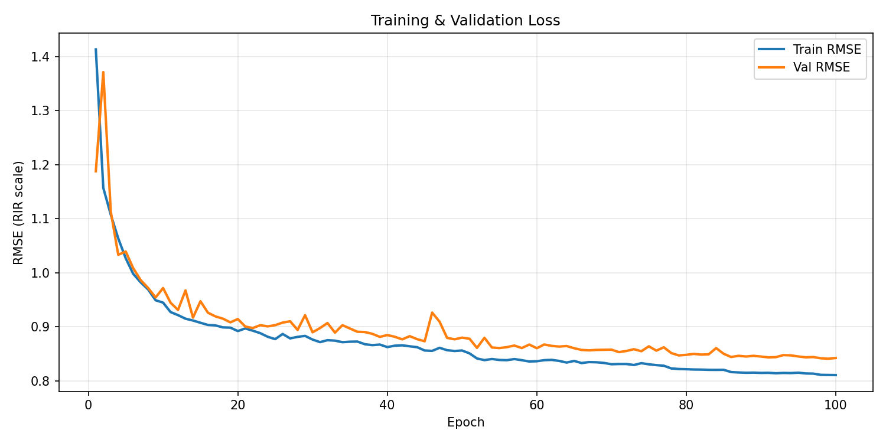
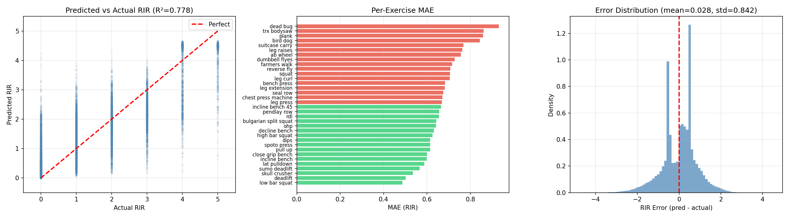
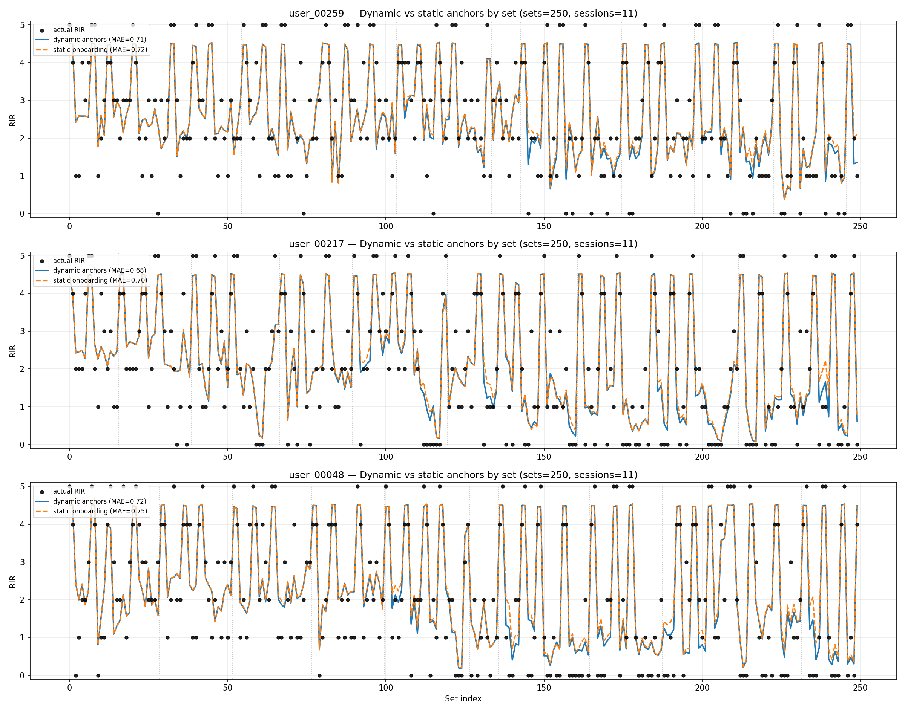
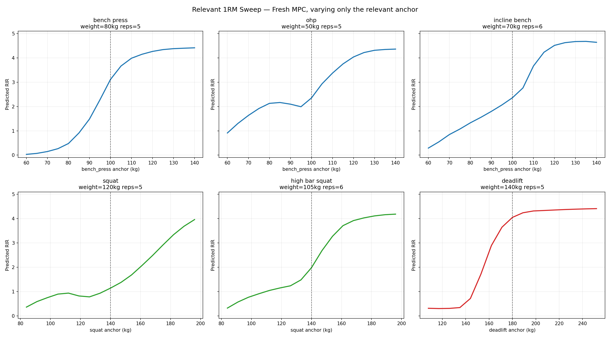
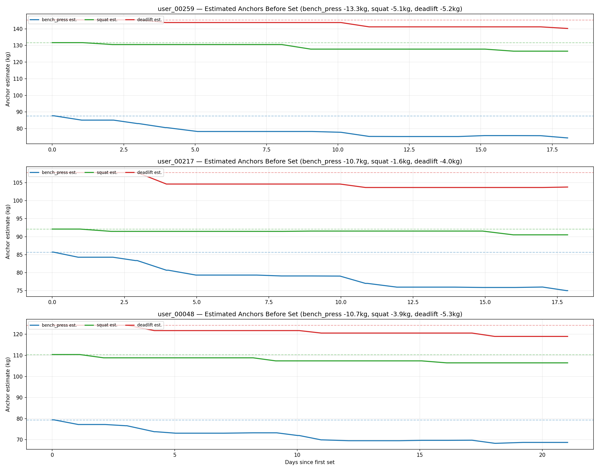
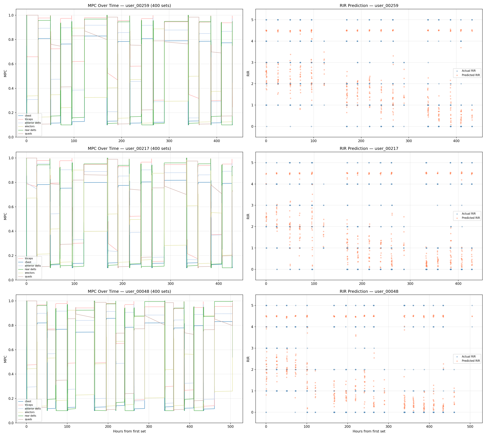
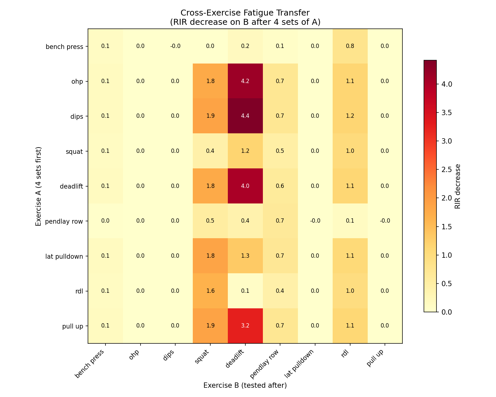
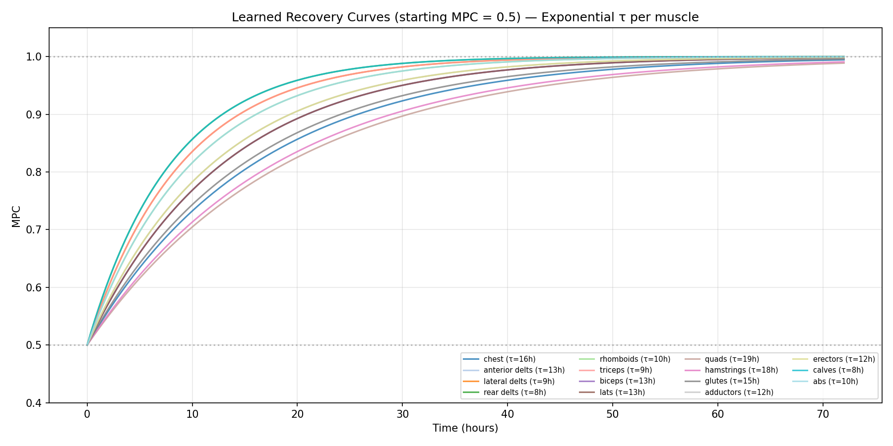
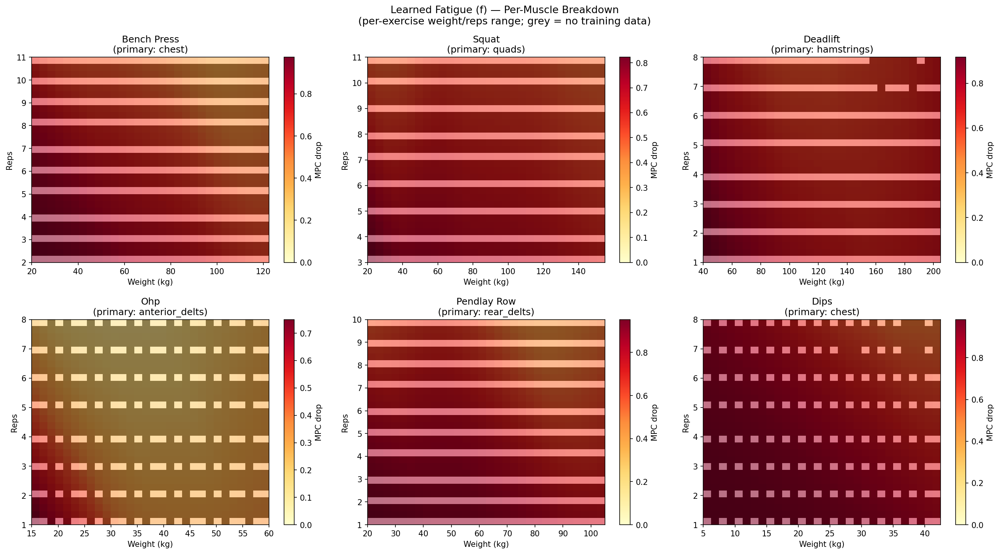

# Wariant 2 — Personalizacja przez 1RM anchors

## Problem który rozwiązuje ten etap

Model w wersji M8 (baseline) nie odróżniał silnych od słabych użytkowników.
`g_net` (predykcja RIR) dostawał `(weight, reps, mpc, exercise_embed)` — bez żadnej informacji o sile danej osoby.

**Efekt:** bench 80kg × 5 dawał identyczny przewidywany RIR dla amatora i zawodowca.

```
Osoba A (1RM=140kg): bench 80kg ≈ 57% 1RM → w rzeczywistości RIR 4-5
Osoba B (1RM= 60kg): bench 80kg ≈ 133% 1RM → w rzeczywistości niemożliwe (RIR 0)
Stary model: oba → RIR ~2.5 (populacyjna średnia)
```

Dla planera to oznacza: ten sam plan dla amatora i zawodowca, bez personalizacji.

---

## Co zostało zaimplementowane

### Architektura — strength anchors

User podaje przy onboardingu 3 wartości 1RM z trójboju:
- `bench_press` (anchor press)
- `squat` (anchor lower body)
- `deadlift` (anchor pull / lower body)

Z tych 3 wartości model projketuje 1RM dla każdego z 34 ćwiczeń przez tablicę priorów:

```
exercise_1rm = anchor_1rm × ratio_mean
```

Przykład dla bench 1RM = 100kg:
| Ćwiczenie | Ratio | Projected 1RM |
|---|---:|---:|
| incline_bench | 0.815 | 81.5kg |
| ohp | 0.620 | 62.0kg |
| dips | 0.635 | 63.5kg |
| lat_pulldown | 0.680 | 68.0kg |
| skull_crusher | 0.295 | 29.5kg |

### Co model widzi teraz

Obie sieci (`f_net` i `g_net`) dostają `strength_feat` — wektor 6 cech:
```
[bench_anchor, squat_anchor, deadlift_anchor,
 projected_1rm_dla_tego_cwiczenia,
 relative_load (weight / projected_1rm),
 anchor_available]
```

`relative_load` to kluczowy sygnał: "ile procent swojego maksimum dźwiga ta osoba przy tym secie".

### Dynamic anchor update

Anchory nie są statyczne — aktualizują się po każdej sesji na podstawie rzeczywiście wykonanych setów (Epley + RIR → e1RM candidate → weighted EMA):

```
nowy_anchor = 0.85 × stary_anchor + 0.15 × session_candidate
cap: max ±4% zmiany per sesja
filtr: tylko sety RIR ≤ 3, relative_load ≥ 0.50, reps ≤ 10
```

---

## Metryki

| Model | Epoki | Val RMSE | Test MAE | Ordering |
|---|---:|---:|---:|---:|
| M8 baseline (bez personalizacji) | 100 | 0.848 | 0.656 | 93% |
| Wariant 2 @ 40ep | 40 | 0.872 | 0.704 | 94% |
| **Wariant 2 @ 100ep** | **100** | **0.841** | **0.658** | **92%** |

Wariant 2 @ 100ep **pobił baseline** (0.841 < 0.848) przy zachowaniu identycznego MAE.

---

## Dowód personalizacji

Dwie osoby, ten sam set, świeże mięśnie (MPC=1.0):

| Ćwiczenie | Ciężar | Silny (1RM=140/200/240) | Słaby (1RM=60/80/100) | Δ RIR |
|---|---|---:|---:|---:|
| bench_press | 80kg × 5 | **4.43** | **0.03** | +4.40 |
| squat | 100kg × 5 | **4.44** | **0.46** | +3.98 |
| deadlift | 150kg × 5 | **4.36** | **0.08** | +4.28 |

Stary model zwracałby identyczną wartość (~2.5) dla obu.

---

## Kalibracja heavy sets

Dla bench 1RM=140kg — jak RIR zmienia się z ciężarem:

| Ciężar | % 1RM | Stary model | **Wariant 2** | Dane (dominant RIR) |
|---|---:|---:|---:|---|
| 80kg | 57% | ~4.5 | 4.43 | RIR 4-5 |
| 100kg | 71% | ~4.5 | 4.04 | RIR 4-5 |
| 120kg | 86% | 3.69 | **2.10** | **RIR 0-1** |

Kluczowa poprawa: heavy set (86% 1RM) teraz poprawnie kalibrowany.

---

## Wykresy z ostatniego treningu (100ep, 2026-04-24)

### Loss curves


### RIR accuracy


### Dynamic vs static anchors
Porównanie predykcji RIR z dynamicznie aktualizowanymi anchorami vs statycznym onboardingiem:



### 1RM sweep — jak RIR reaguje na siłę usera
Dla stałego ciężaru, zmieniając tylko anchor 1RM — czytelna sigmoidalna odpowiedź:



### Anchor trajectories — dynamiczny update w czasie
Jak anchory ewoluują przez sesje treningowe:



### MPC trajectories — trajektorie zmęczenia mięśni


### Cross-exercise fatigue transfer
Jak zmęczenie z ćwiczenia A wpływa na RIR przy ćwiczeniu B:



### Recovery curves per muscle


### Fatigue heatmaps (weight × reps → MPC drop)


---

## Publiczne API (inference.py)

```python
from inference import load_model, predict_mpc, predict_rir, update_strength_anchors

model = load_model("deepgain_model_best.pt")

# Onboarding
strength_anchors = {"bench_press": 100.0, "squat": 140.0, "deadlift": 180.0}

# Stan mięśni przed sesją
mpc = predict_mpc(model, user_history, timestamp, strength_anchors=strength_anchors)

# Przewidywany RIR dla planowanego seta
rir = predict_rir(model, mpc, "bench_press", 80.0, 5, strength_anchors=strength_anchors)

# Update po sesji
strength_anchors = update_strength_anchors(strength_anchors, completed_sets)
```

---

## Znane ograniczenia

| Ograniczenie | Status |
|---|---|
| Pull exercises (row, pull-up) zakotwiczone do bench — słaba korelacja | Znane, wymaga 4. anchor lub `row_1rm` w onboardingu |
| `leg_curl` zakotwiczone do squat zamiast deadlift | Do poprawki w następnej iteracji |
| 9 ćwiczeń bodyweight (plank, farmers_walk itd.) bez personalizacji | Wymaga zbierania masy ciała od usera |
| Dynamic update daje małą poprawę MAE (0.73 vs 0.75 static) | Do tuningu w kolejnym etapie |

---

## Checkpoint

| Plik | Opis |
|---|---|
| `deepgain_model_best.pt` | Best val checkpoint (100ep, RMSE 0.841) |
| `deepgain_model_muscle_ord.pt` | Final checkpoint (100ep) |
| `inference.py` | Publiczne API — stabilny kontrakt dla Miłosza |
| `strength_priors.py` | Tabela priorów, logika update anchors |
| `README_INFERENCE.md` | Pełna dokumentacja integracyjna |
| `test_inference_personalization.py` | Smoke test end-to-end |
